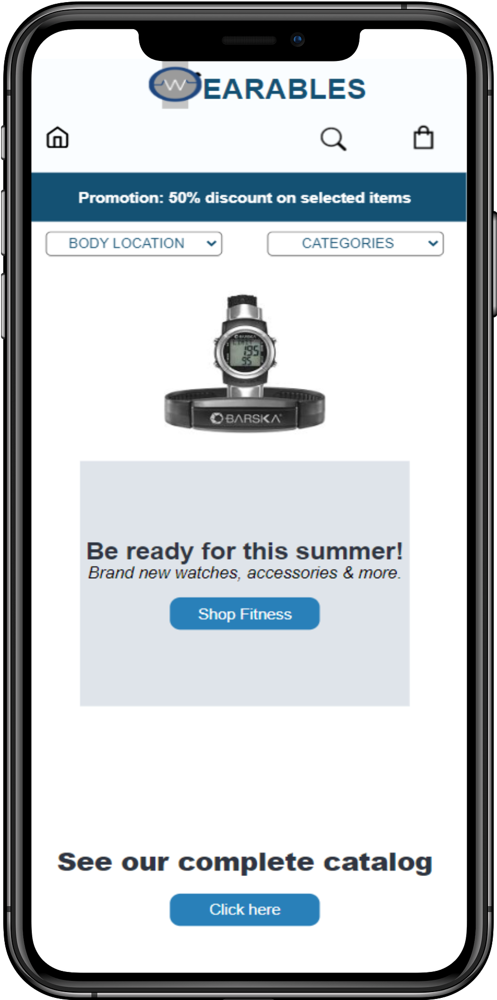
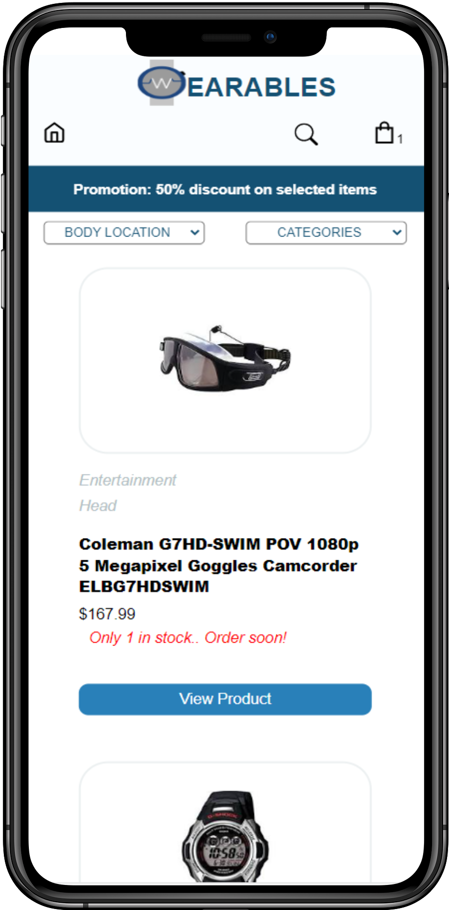
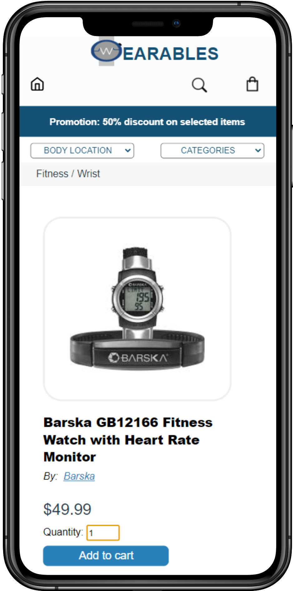
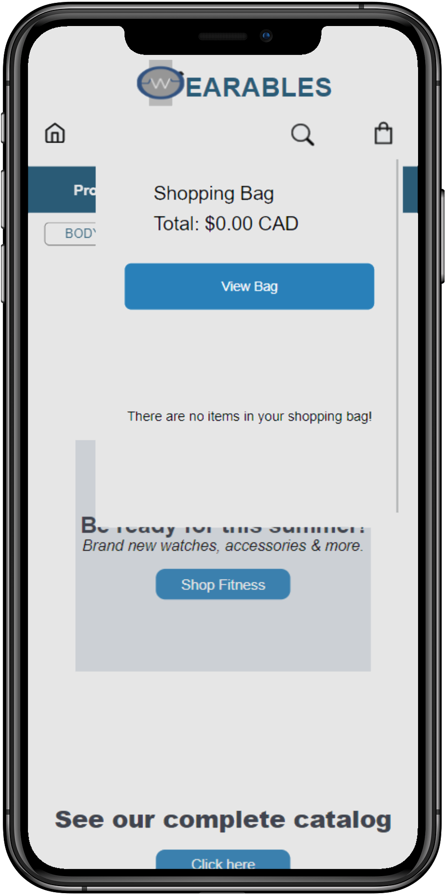
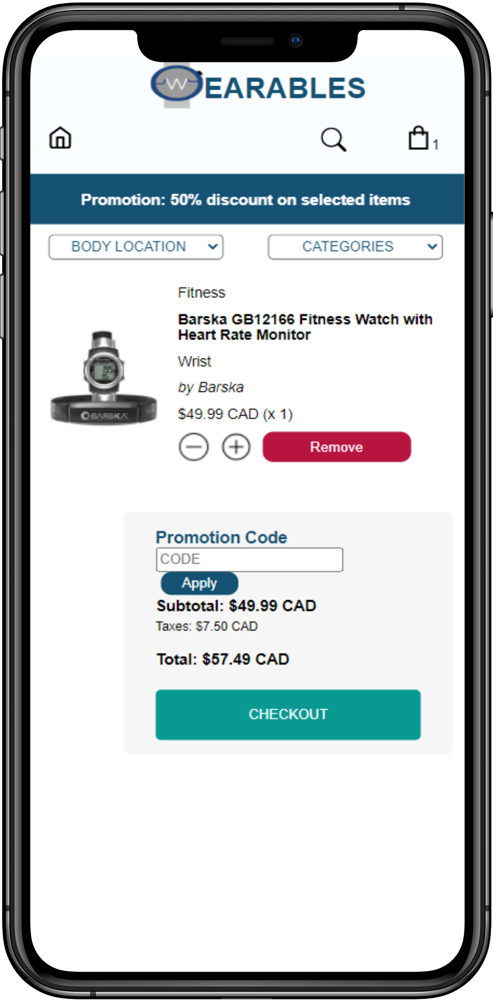
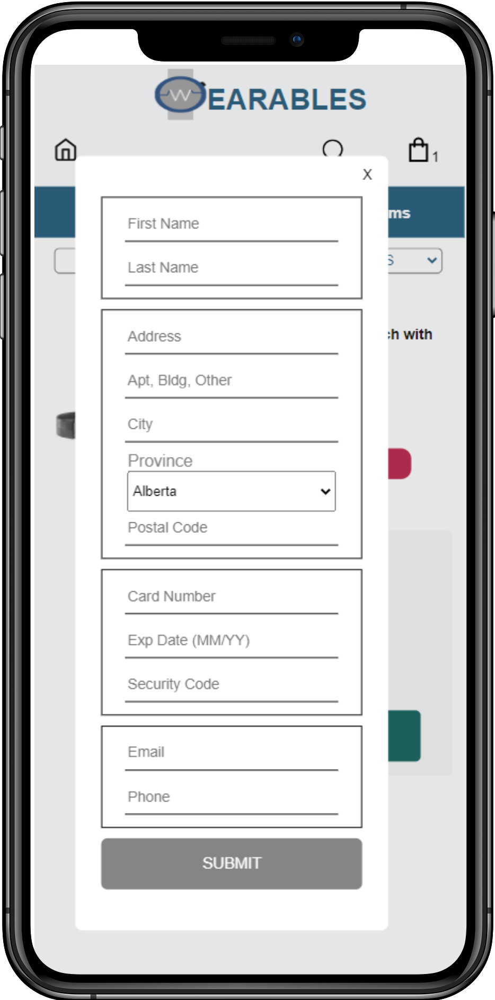

# Wearables E-commerce Platform

## Introduction

This is a web app that gives users an unique shopping experience. Users can pick desired products, add them into bag and complete their orders in very easy steps. The app has been desinged responsive so user can use it either on the web or mobile.
## Built with

- React Native
- NodeJS
- MongoDB

## Features/Technologies used

- React Router Dom
- Styled Components
- Express.js
- Tippy.js
- Dotenv

## Contributers

- [Gabrielle Le Sauteur](https://github.com/glesauteur)
- [Cesar Villao](https://github.com/cesarvil)
- [Kutay Furtun](https://github.com/kfurtun)

## Screenshots

&nbsp;&nbsp;

&nbsp;&nbsp;

### Responsive screenshots

&nbsp;&nbsp;
&nbsp;&nbsp;
 &nbsp;&nbsp;

&nbsp;&nbsp;
&nbsp;&nbsp;
 &nbsp;&nbsp;
 &nbsp;&nbsp;

